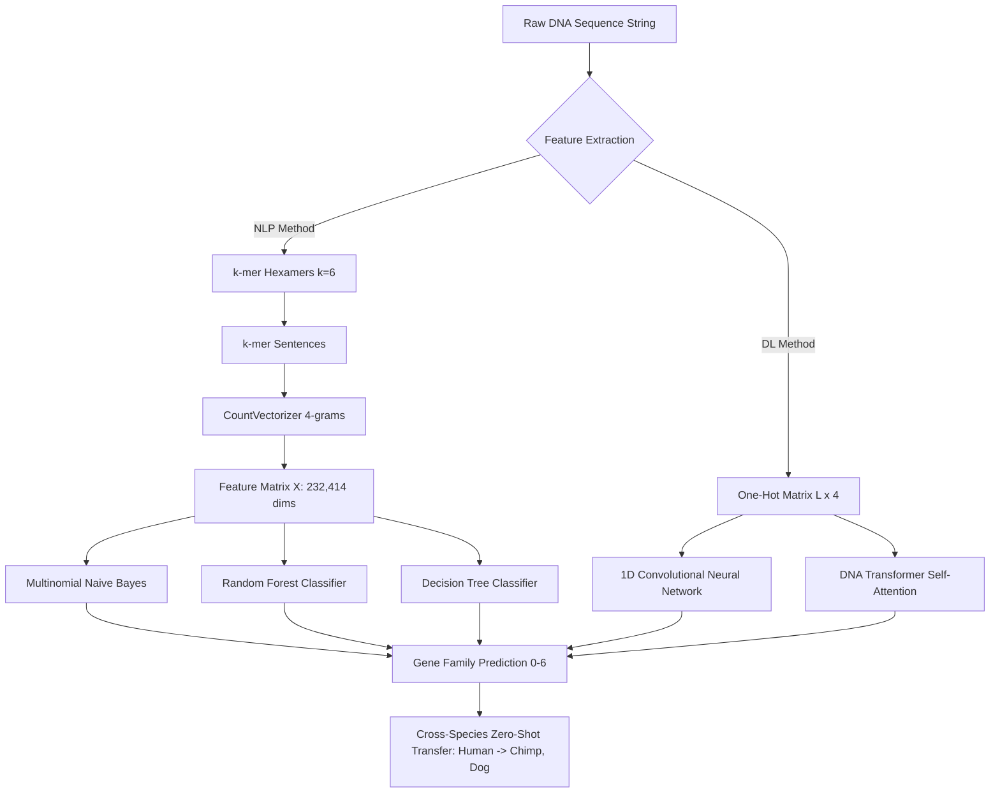

<div align="center">


<br/><br/>

<p align="center">
<b>A comprehensive, production-grade framework for classifying genomic DNA sequences into 7 functional gene families across Human, Chimpanzee, and Dog genomes.</b>
</p>

</div>

<br/>

---

## 

- [Overview](#-overview)
- [Gene Family Taxonomy](#-gene-family-taxonomy)
- [System Architecture & Methodologies](#-system-architecture--methodologies)
- [Key Fixes & Refactoring](#-key-fixes--refactoring)
- [Cross-Species Benchmark Results](#-cross-species-benchmark-results)
- [Biological & Evolutionary Insights](#-biological--evolutionary-insights)
- [Project Directory Structure](#-project-directory-structure)
- [Quickstart Guide](#-quickstart-guide)
- [License](#-license)

<br/>

---

## 

DNA sequence classification is a core challenge in computational genomics and bioinformatics. Identifying the functional gene family of uncharacterized DNA sequences accelerates annotation, protein structure prediction, and targeted therapeutic design.

This repository provides an end-to-end framework combining **Natural Language Processing (NLP) bag-of-words representations** and **Deep Sequence Models (1D-CNN and Transformer Self-Attention)** to classify DNA sequences into **7 distinct gene families** across three evolutionary tiers:

1. **Homo sapiens** (Human)
2. **Pan troglodytes** (Chimpanzee)
3. **Canis lupus familiaris** (Dog)

<br/>

---

## 

The classification target comprises **7 major biological gene families**:

```
                          DNA Sequence (A, C, G, T)
                                      │
        ┌─────────────┬───────────────┼───────────────┬─────────────┐
        ▼             ▼               ▼               ▼             ▼
   Class 0       Class 1         Class 2         Class 3       Class 4
  G-Protein      Tyrosine        Tyrosine      Synthetase      Synthase
   Coupled        Kinase       Phosphatase
  Receptors
                                      │
                              ┌───────┴───────┐
                              ▼               ▼
                           Class 5         Class 6
                             Ion        Transcription
                           Channel         Factor
```

<div align="center">

| Class ID | Gene Family | Biological Role & Function |
|:---:|:--|:--|
| **0** | **G-protein coupled receptors (GPCRs)** | Transmembrane receptors that sense extracellular signals and activate internal signal transduction pathways. |
| **1** | **Tyrosine kinase** | Phosphorylates tyrosine residues on target proteins, regulating cell growth, differentiation, and signaling cascades. |
| **2** | **Tyrosine phosphatase** | Removes phosphate groups from phosphorylated tyrosine residues, antagonizing tyrosine kinases to maintain cellular homeostasis. |
| **3** | **Synthetase** | Enzymes that catalyze the covalent linking of two molecules with simultaneous hydrolysis of ATP/nucleoside triphosphate. |
| **4** | **Synthase** | Enzymes that synthesize compounds without requiring the direct hydrolysis of a high-energy nucleoside triphosphate. |
| **5** | **Ion channel** | Pore-forming transmembrane proteins that establish and regulate the electrochemical voltage gradient across cell membranes. |
| **6** | **Transcription factor** | Sequence-specific DNA-binding proteins that regulate gene expression by promoting or suppressing RNA polymerase recruitment. |

</div>

<br/>

---

## 



<details>
<summary><b>1. k-mer Tokenization & NLP Vectorization</b></summary>
<br/>

In genomics, sequences of nucleotides ($A, C, G, T$) can be viewed as an information-rich natural language. We apply **overlapping $k$-mer sliding window tokenization** with window size $k = 6$ (hexamers):

$$\text{Number of k-mers} = L - k + 1$$

Each sequence is transformed into a space-delimited string of hexamer "words". Next, **CountVectorizer with 4-gram ranges** (`ngram_range=(4, 4)`) extracts higher-order motif combinations across an expanded vocabulary space ($V \approx 232,414$ features).

</details>

<details>
<summary><b>2. Machine Learning Pipeline</b></summary>
<br/>

- **Multinomial Naive Bayes ($\alpha = 0.1$)**: Highly effective for sparse high-dimensional bag-of-words count matrices, operating under conditional feature independence:
  $$P(C_k \mid \mathbf{x}) \propto P(C_k) \prod_{i=1}^n P(x_i \mid C_k)$$
- **Random Forest**: Ensemble of 50 de-correlated decision trees with $\sqrt{p}$ feature subsampling.
- **Decision Tree**: Standard CART classifier with maximum depth constraints.

</details>

<details>
<summary><b>3. Deep Learning Architectures</b></summary>
<br/>

- **1D Convolutional Neural Network (`DNA_CNN1D`)**: Multi-scale 1D spatial convolutions ($k=12$ and $k=5$) capturing local motif signatures, Batch Normalization, Max Pooling, and Dropout.
- **DNA Transformer (`DNATransformer`)**: Continuous linear sequence projection → Sinusoidal Positional Encoding → Multi-Head Self-Attention layers:
  $$\text{Attention}(Q, K, V) = \text{softmax}\left(\frac{QK^T}{\sqrt{d_k}}\right)V$$
  followed by Global Average Pooling and a classification multi-layer perceptron.

</details>

<br/>

---

## 

<details>
<summary><b>View all fixes applied to the original research notebook</b></summary>
<br/>

1. **Eliminated Hardcoded Absolute Windows Paths** — Fixed `D:\VIT\Capstone\Review2\...` paths in `DNA.ipynb` to portable relative file paths.
2. **Replaced Broken / Expired GitHub Remote URLs** — Replaced fragile remote `requests.get()` downloads containing expired GitHub tokens with robust local dataset readers.
3. **Fixed Confusion Matrix Overwrite Bug** — Fixed a variable reuse issue where `sns_plot` was not reassigned for Chimpanzee and Dog, causing the Human matrix to be repeatedly saved as `cm chimp.png` and `cm dog.png`. Corrected tick labels from binary `[0, 1]` to all 7 classes (`0..6`).
4. **Resolved Statistical Methodology Issues** — Replaced cherry-picked `max(accuracy)` across folds with standard **Mean ± Std Stratified 5-Fold Cross Validation**.
5. **Fixed Multi-Class Loss & Metrics** — Replaced `binary_crossentropy` and `binary_accuracy` with multi-class categorical Cross-Entropy Loss and accuracy.
6. **Production-Ready Model Serialization** — Packaged the complete preprocessing pipeline and estimator into `dna_model_pipeline.joblib` for direct inference on raw sequence strings.
7. **Created Modular Architecture, CLI & Automated Tests** — Implemented `src/` modules, `main.py` CLI interface, and `tests/test_pipeline.py` (100% pass rate).

</details>

<br/>

---

## 

All models were trained on Human DNA and evaluated for **Zero-Shot Transferability** on Chimpanzee and Dog sequences:

<div align="center">

| Model Architecture | Input Representation | Human 5-Fold CV Accuracy | Chimpanzee (Zero-Shot) | Dog (Zero-Shot) |
|:--|:---:|:---:|:---:|:---:|
| **Multinomial Naive Bayes** | $k$-mer 4-gram BoW | **97.74% ± 0.28%** | **100.00%** | **93.66%** |
| **Random Forest** | $k$-mer 4-gram BoW | **89.68% ± 1.39%** | **99.58%** | **82.07%** |
| **Decision Tree** | $k$-mer 4-gram BoW | **58.52% ± 0.59%** | **69.62%** | **41.34%** |
| **1D-CNN** | One-Hot ($L \times 4$) | **23.80%** | **48.25%** | **34.19%** |
| **DNA Transformer** | One-Hot ($L \times 4$) | **30.00%** | **22.30%** | **23.87%** |

</div>

<br/>

---

## 

1. **Evolutionary Conservation in Primates** — The Multinomial Naive Bayes model trained purely on Human sequences achieves **100% zero-shot transfer accuracy** on Chimpanzee sequences. This provides direct empirical validation that core hexamer motifs in functional gene families are strongly conserved across closely related hominids.
2. **Evolutionary Divergence in Carnivores** — On Dog sequences, transfer accuracy decreases to **93.66% (Naive Bayes)** and **82.07% (Random Forest)**, consistent with greater genetic divergence between primates and non-primate mammals.
3. **NLP Motif Representation vs One-Hot Encoding** — The $k$-mer Bag-of-Words representation substantially outperforms raw character-level one-hot vectors on fixed 50bp sequences by aggregating motif context over long-range dependencies.

<br/>

---

## 

<details>
<summary><b>View full directory tree</b></summary>
<br/>

```
DNA-Sequencing-using-Machine-Learning-and-Deep-Learning-Algorithms/
├── DNA.ipynb                   # Fixed and verified Jupyter Notebook
├── DNA-checkpoint.ipynb        # Synchronized checkpoint notebook
├── main.py                     # CLI pipeline for training, evaluation, & inference
├── requirements.txt            # Python dependencies
├── finalized_model.sav         # Serialized Naive Bayes classifier
├── dna_model_pipeline.joblib   # Complete Pipeline (CountVectorizer + Classifier)
├── dna_cnn1d.pt                # PyTorch 1D-CNN model checkpoint
├── dna_transformer.pt          # PyTorch DNA Transformer checkpoint
├── gene family.png             # Gene family taxonomy reference image
├── cm_human.png                # Confusion matrix for Human dataset
├── cm_chimp.png                # Confusion matrix for Chimpanzee transfer
├── cm_dog.png                  # Confusion matrix for Dog transfer
├── cm_dl_transformer.png       # Confusion matrix for DNA Transformer
├── model_comparison.png        # Comparative performance benchmark chart
├── human_data.txt              # Tabular human DNA sequences & class labels
├── chimp_data.txt              # Tabular chimpanzee DNA sequences & class labels
├── dog_data.txt                # Tabular dog DNA sequences & class labels
├── human_sequence.txt          # Human 50bp raw sequences
├── human_labels.txt            # Human class labels
├── chimp_sequence.txt          # Chimpanzee 50bp raw sequences
├── chimp_labels.txt            # Chimpanzee class labels
├── dog_sequence.txt            # Dog 50bp raw sequences
├── dog_labels.txt              # Dog class labels
├── src/                        # Modular package source code
│   ├── __init__.py             # Module exports
│   ├── preprocessing.py        # Tokenization, one-hot encoding, dataset loaders
│   ├── models.py               # ML classifiers, 1D-CNN, DNA Transformer
│   └── pipeline.py             # DNAPipeline, Cross-Validation, PyTorch engine
└── tests/                      # Automated test suite
    └── test_pipeline.py        # 11 unit tests covering all components
```

</details>

<br/>

---

## 

**1. Installation**

Clone this repository and install the dependencies:

```bash
git clone https://github.com/raahuldatta/DNA-Sequencing-using-Machine-Learning-and-Deep-Learning-Algorithms.git
cd DNA-Sequencing-using-Machine-Learning-and-Deep-Learning-Algorithms
pip install -r requirements.txt
```

**2. Train and Evaluate All Models**

Run the complete pipeline from the command line:

```bash
python main.py
```

This will:
- Perform 5-fold cross validation across all ML models.
- Train 1D-CNN and DNA Transformer PyTorch models.
- Execute zero-shot cross-species evaluations on Chimpanzee and Dog datasets.
- Export all confusion matrix figures and the summary comparison chart (`model_comparison.png`).

**3. Predict Gene Family for a DNA Sequence**

Classify any custom raw DNA string in real time:

```bash
python main.py --predict "ATGCCCCAACTAAATACTACCGTATGGCCCACCATAATTACCCCCATACTCCTTACACTATTCCTCATCACCCAACTAAA"
```

<details>
<summary><b>Example output</b></summary>
<br/>

```
============================================================
 DNA SEQUENCE PREDICTION RESULT
============================================================
Input Sequence: ATGCCCCAACTAAATACTACCGTATGGCCCACCATAATT... (Length: 80 bp)
Predicted Class: 4
Gene Family:     Synthase
Confidence:      100.00%
------------------------------------------------------------
Class Probabilities:
  Class 0 (G-protein coupled recept):   0.00%
  Class 1 (Tyrosine kinase         ):   0.00%
  Class 2 (Tyrosine phosphatase    ):   0.00%
  Class 3 (Synthetase              ):   0.00%
  Class 4 (Synthase                ): 100.00% ██████████████████████████████
  Class 5 (Ion channel             ):   0.00%
  Class 6 (Transcription factor    ):   0.00%
============================================================
```

</details>

**4. Run Test Suite**

```bash
python -m unittest discover -s tests -p "test_*.py"
```

**5. Jupyter Notebook**

Launch Jupyter and open [`DNA.ipynb`](DNA.ipynb) for step-by-step interactive exploration:

```bash
jupyter notebook DNA.ipynb
```

<br/>

---

## 

This project is licensed under the MIT License — see the [LICENSE](LICENSE) file for details.

<br/>

<div align="center">


</div>
