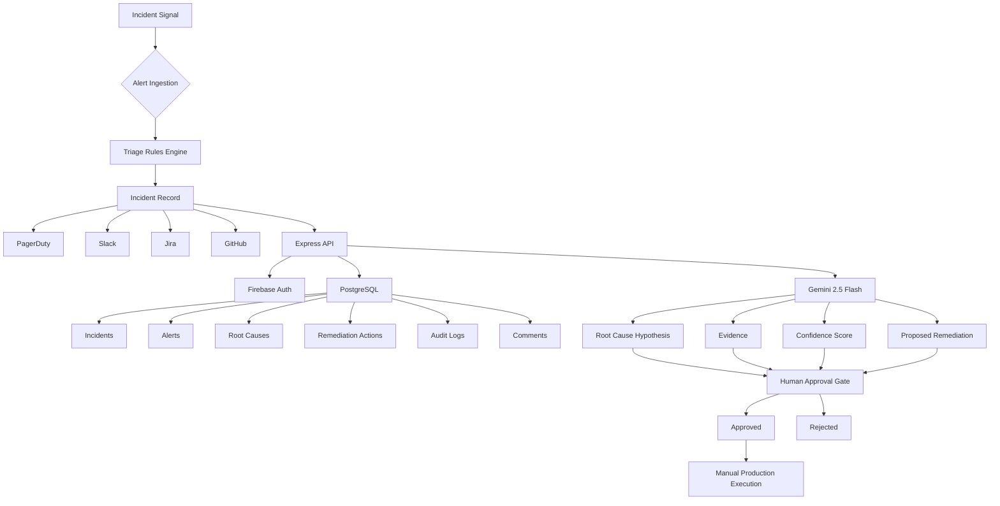

<div align="center">


<h1 align="center">🔥 Ember</h1>
<p align="center"><i>AI Incident Response Engineer</i></p>


<br/><br/>

<p align="center">
<b>An AI-powered incident response platform that connects PagerDuty, Slack, Jira, and GitHub into a single operational workspace for investigating incidents, generating evidence-backed root-cause hypotheses, and routing remediation through human approval.</b>
</p>

<p align="center">
Built with <b>React</b>, <b>TypeScript</b>, <b>Express</b>, <b>PostgreSQL</b>, <b>Firebase Auth</b>, and <b>Gemini 2.5 Flash</b>.
</p>

</div>

<br/>

---

## 

* [Overview](#-overview)
* [Core Principle](#-core-principle)
* [Feature Breakdown](#-feature-breakdown)
* [System Architecture](#-system-architecture)
* [Data Model](#-data-model)
* [API Reference](#-api-reference)
* [Project Directory Structure](#-project-directory-structure)
* [Tech Stack](#-tech-stack)
* [Quickstart Guide](#-quickstart-guide)
* [Integrations Setup](#-integrations-setup)
* [Deployment](#-deployment)
* [Known Limitations / Roadmap](#-known-limitations--roadmap)
* [License](#-license)

<br/>

---

## 

Production incidents rarely fail because teams lack monitoring tools. They fail because engineers have to jump between multiple systems to understand **what happened, what changed, who owns it, and what should happen next**.

Ember is designed to compress that first-response workflow into a single incident-management workspace.

It ingests incidents through webhooks or manual creation, automatically applies configurable triage rules, connects operational context across **PagerDuty, Slack, Jira, and GitHub**, and uses **Gemini 2.5 Flash** to generate an evidence-backed root-cause hypothesis.

The AI investigation produces:

* A root-cause hypothesis
* Supporting evidence
* A confidence score
* A proposed remediation action
* A structured remediation payload

Most importantly, Ember does **not** automatically execute production changes.

Every proposed remediation action enters a `proposed` state and requires an authenticated engineer to explicitly **Approve** or **Reject** it.

> **Ember investigates. Humans decide.**

The current build is a functional prototype with a full incident-management UI, Express + PostgreSQL backend, Firebase authentication, Gemini-powered investigation, and integrations with PagerDuty, Slack, Jira, and GitHub.

<br/>

---

## 

<div align="center">

> ## 🔥 Ember investigates. Humans decide.

| Ember does                                          | Ember never does                           |
| :-------------------------------------------------- | :----------------------------------------- |
| Aggregates incidents from webhooks and manual entry | Executes a production change automatically |
| Applies configurable triage rules                   | Auto-approves its own remediation          |
| Investigates incidents using Gemini                 | Applies remediation without human approval |
| Generates evidence-backed RCA hypotheses            | Silently modifies infrastructure           |
| Proposes remediation actions                        | Deletes or hides audit history             |
| Maintains an incident activity trail                | Bypasses the approval gate                 |

</div>

Every approval and rejection is recorded in the `audit_logs` table with the acting user's ID, timestamp, action, and supporting details.

This creates a clear separation between **AI-assisted investigation** and **human-controlled production action**.

<br/>

---

## 

<details>
<summary><b>🔐 Authentication & Access</b></summary>

<br/>

* Google Sign-In through **Firebase Authentication**.
* Backend authentication middleware verifies Firebase ID tokens on every protected request.
* Authenticated users are synchronized into the PostgreSQL `users` table.
* Optional GitHub OAuth allows users to connect their GitHub account for repository, deployment, and pull-request context.
* GitHub credentials are stored against the authenticated user's database record.

</details>

<details>
<summary><b>🚨 Incident Management</b></summary>

<br/>

* Centralized incident dashboard.
* Filter incidents by:

  * Status
  * Severity
  * Service
* Free-text service search.
* Recent searches persisted through `localStorage`.
* Manual incident creation.
* Bulk investigation.
* Bulk incident resolution.
* Incident assignment.
* Incident tagging.
* Threaded incident comments.
* Live incident polling every 10 seconds.
* Desktop notifications for new Sev1 incidents.
* Viewer presence indicators showing who is currently viewing an incident.

</details>

<details>
<summary><b>⚡ Alert Ingestion & Auto-Triage</b></summary>

<br/>

External monitoring systems can send alerts into:

```text
POST /api/webhooks/alerts
```

Incoming alerts are evaluated against configurable triage rules.

Rules can match:

* Alert source
* Alert title
* Arbitrary payload fields

Supported operators include:

```text
equals
contains
```

The first matching rule can automatically determine:

```text
Severity
Assigned Team
```

For Sev1 incidents:

1. Ember creates the incident.
2. PagerDuty is triggered.
3. Slack receives a notification.

</details>

<details>
<summary><b>🤖 AI Investigation with Gemini</b></summary>

<br/>

The **Investigate** workflow sends incident context to Gemini 2.5 Flash and requests a structured JSON response.

The investigation produces:

| Field                    | Description                         |
| :----------------------- | :---------------------------------- |
| `hypothesis`             | AI-generated root-cause explanation |
| `evidence`               | Supporting evidence                 |
| `confidence`             | Confidence score from 0–100         |
| `remediationDescription` | Proposed remediation                |
| `actionType`             | Type of proposed action             |
| `actionPayload`          | Structured remediation payload      |

The result is persisted as:

```text
root_causes
remediation_actions
```

The incident then moves into:

```text
pending_approval
```

A separate **Summarize** action generates a concise executive summary for stakeholders based on the incident context and audit history.

</details>

<details>
<summary><b>🧠 Human Approval Workflow</b></summary>

<br/>

Every remediation action follows a controlled state transition:

```text
AI Investigation
       │
       ▼
Proposed Remediation
       │
       ▼
Human Approval Gate
     /     \
    ▼       ▼
Approve   Reject
```

Approval and rejection capture:

* Acting user
* Timestamp
* Decision
* Reason
* Incident context

Approval does **not** execute the remediation payload.

This intentionally keeps production execution under human control.

</details>

<details>
<summary><b>🔗 Engineering Integrations</b></summary>

<br/>

### PagerDuty

* Trigger Sev1 incidents.
* Resolve linked incidents during bulk resolution.

### Slack

* Notify the team when incidents are created.
* Notify the team when bulk actions occur.
* Send Jira ticket creation notifications.

### Jira

* Create Jira issues directly from an incident.
* Automatically prefix generated tickets with `[Ember]`.

### GitHub

* OAuth account connection.
* Repository and deployment context foundation.
* Designed for future investigation enrichment.

</details>

<details>
<summary><b>📄 Reporting & Export</b></summary>

<br/>

* Reusable RCA templates.
* Standard microservice outage template seeded automatically.
* Incident PDF export.
* Incident reports generated from the incident detail view.
* Jira ticket creation directly from incidents.

PDF generation uses:

```text
html2canvas
jsPDF
```

</details>

<details>
<summary><b>🕓 Activity & History</b></summary>

<br/>

Every incident provides three primary views:

| View         | Purpose                     |
| :----------- | :-------------------------- |
| **Comments** | Team discussion             |
| **History**  | Incident lifecycle timeline |
| **Work Log** | System and user activity    |

This creates a complete operational record of the incident lifecycle.

</details>

<br/>

---

## 



<div align="center">

| Layer               | Technology               | Responsibility                               |
| :------------------ | :----------------------- | :------------------------------------------- |
| Frontend            | React 19 + Vite          | Incident dashboard and operational UI        |
| Styling             | Tailwind CSS v4          | Application styling                          |
| Backend             | Express 4 + TypeScript   | API and application server                   |
| Authentication      | Firebase Auth            | Google authentication and token verification |
| Database            | PostgreSQL + Drizzle ORM | Persistent application state                 |
| AI                  | Gemini 2.5 Flash         | Investigation and summarization              |
| Incident Management | PagerDuty                | Alert triggering and resolution              |
| Collaboration       | Slack                    | Operational notifications                    |
| Ticketing           | Jira REST API            | Issue creation                               |
| Source Control      | GitHub OAuth             | Repository/deployment context                |
| Validation          | Zod                      | Runtime schema validation                    |

</div>

> **Architecture note:** LangChain Core and LangGraph are installed dependencies, but the current investigation implementation calls Gemini directly through a single investigation flow rather than a LangGraph state graph.

<br/>

---

## 

<details>
<summary><b>View database schema</b></summary>

<br/>

| Table                 | Purpose                        | Key Data                                                       |
| :-------------------- | :----------------------------- | :------------------------------------------------------------- |
| `users`               | Application users              | Firebase UID, email, name, role, GitHub token                  |
| `incidents`           | Core incident records          | Title, description, status, severity, services, tags, assignee |
| `triage_rules`        | Automated alert classification | Conditions, severity, team                                     |
| `rca_templates`       | Reusable RCA structures        | Template name and content                                      |
| `alerts`              | Raw external alerts            | Source, external ID, payload                                   |
| `root_causes`         | AI investigation results       | Hypothesis, evidence, confidence                               |
| `remediation_actions` | Proposed decisions             | Description, type, payload, approval status                    |
| `audit_logs`          | Complete activity history      | User, action, details, timestamp                               |
| `comments`            | Incident discussions           | User, incident, content                                        |

### Incident Status

```text
triggered
    │
    ▼
investigating
    │
    ▼
pending_approval
    │
    ├──► resolved
    │
    └──► aborted
```

### Severity Levels

```text
sev1
sev2
sev3
```

</details>

<br/>

---

## 

<details>
<summary><b>View API routes</b></summary>

<br/>

| Method | Route                            | Purpose                       |
| :----- | :------------------------------- | :---------------------------- |
| `GET`  | `/api/health`                    | Public health check           |
| `POST` | `/api/auth/sync`                 | Synchronize Firebase user     |
| `GET`  | `/api/auth/github/url`           | Generate GitHub OAuth URL     |
| `GET`  | `/auth/github/callback`          | GitHub OAuth callback         |
| `GET`  | `/api/user/github-status`        | Check GitHub connection       |
| `GET`  | `/api/incidents`                 | List incidents                |
| `POST` | `/api/incidents`                 | Create an incident            |
| `GET`  | `/api/incidents/:id`             | Retrieve full incident detail |
| `POST` | `/api/incidents/:id/investigate` | Run AI investigation          |
| `POST` | `/api/incidents/:id/summarize`   | Generate executive summary    |
| `POST` | `/api/incidents/:id/jira`        | Create Jira ticket            |
| `POST` | `/api/incidents/:id/assign`      | Assign incident               |
| `POST` | `/api/incidents/:id/tags`        | Update incident tags          |
| `POST` | `/api/incidents/:id/comments`    | Add comment                   |
| `POST` | `/api/incidents/:id/view`        | Update viewer presence        |
| `POST` | `/api/incidents/bulk`            | Bulk investigate/resolve      |
| `POST` | `/api/actions/:id/approve`       | Approve remediation           |
| `POST` | `/api/actions/:id/reject`        | Reject remediation            |
| `GET`  | `/api/rca-templates`             | List RCA templates            |
| `GET`  | `/api/users`                     | List application users        |
| `POST` | `/api/seed`                      | Seed demo incident            |
| `POST` | `/api/webhooks/alerts`           | Ingest external alert         |

</details>

<br/>

---

## 

<details>
<summary><b>View full directory tree</b></summary>

<br/>

```text
ember/
├── server.ts
├── index.html
├── vite.config.ts
├── drizzle.config.ts
├── tsconfig.json
├── firebase-applet-config.json
├── metadata.json
├── .env.example
├── package.json
│
├── src/
│   ├── main.tsx
│   ├── App.tsx
│   ├── index.css
│   │
│   ├── components/
│   │   ├── AuthProvider.tsx
│   │   ├── Dashboard.tsx
│   │   └── IncidentDetails.tsx
│   │
│   ├── agent/
│   │   └── investigation.ts
│   │
│   ├── lib/
│   │   ├── firebase.ts
│   │   ├── firebase-admin.ts
│   │   ├── pagerduty.ts
│   │   ├── slack.ts
│   │   └── jira.ts
│   │
│   ├── middleware/
│   │   └── auth.ts
│   │
│   └── db/
│       ├── index.ts
│       └── schema.ts
│
└── public/
    └── assets/
        └── aistudio/
```

</details>

<br/>

---

## 

<div align="center">

| Category            | Technology                     |
| :------------------ | :----------------------------- |
| Frontend            | React 19                       |
| Build Tool          | Vite 6                         |
| Language            | TypeScript 5.8                 |
| Styling             | Tailwind CSS v4                |
| Icons / Animation   | lucide-react, motion           |
| Charts              | recharts                       |
| PDF Export          | jsPDF + html2canvas            |
| Backend             | Express 4                      |
| Runtime             | Node.js 18+                    |
| Database            | PostgreSQL                     |
| ORM                 | Drizzle ORM                    |
| Authentication      | Firebase Auth + Firebase Admin |
| AI                  | Gemini 2.5 Flash               |
| Validation          | Zod                            |
| Incident Management | PagerDuty Events API v2        |
| Collaboration       | Slack Incoming Webhooks        |
| Ticketing           | Jira REST API v3               |
| Source Control      | GitHub OAuth                   |
| Package Managers    | npm / Bun                      |

</div>

<br/>

---

## 

### **1. Prerequisites**

Make sure you have:

* Node.js 18+
* PostgreSQL
* Firebase project
* Google Sign-In enabled in Firebase
* Gemini API key

<br/>

### **2. Clone the Repository**

```bash
git clone https://github.com/raahuldatta/Ember.git
cd Ember
npm install
```

<br/>

### **3. Configure Firebase**

1. Create a Firebase project.
2. Enable **Authentication → Sign-in method → Google**.
3. Register a Web App.
4. Copy the Firebase configuration into:

```text
firebase-applet-config.json
```

5. Configure Firebase Admin credentials for server-side ID-token verification.

<br/>

### **4. Configure PostgreSQL**

Set the credentials required by Drizzle:

```bash
export SQL_HOST=localhost
export SQL_DB_NAME=ember
export SQL_ADMIN_USER=postgres
export SQL_ADMIN_PASSWORD=yourpassword
```

Then push the schema:

```bash
npm run db:push
```

The running application uses:

```text
DATABASE_URL
```

for its runtime PostgreSQL connection.

<br/>

### **5. Configure Environment Variables**

Copy:

```bash
cp .env.example .env
```

Then configure the required variables.

<details>
<summary><b>View environment variables</b></summary>

<br/>

| Variable                |       Required       | Purpose                            |
| :---------------------- | :------------------: | :--------------------------------- |
| `GEMINI_API_KEY`        |          Yes         | Gemini investigation and summaries |
| `APP_URL`               | Yes for GitHub OAuth | OAuth redirect base URL            |
| `DATABASE_URL`          |          Yes         | Runtime PostgreSQL connection      |
| `PAGERDUTY_ROUTING_KEY` |       Optional       | PagerDuty triggering/resolution    |
| `PAGERDUTY_API_KEY`     |       Optional       | Future PagerDuty API operations    |
| `SLACK_WEBHOOK_URL`     |       Optional       | Slack notifications                |
| `JIRA_DOMAIN`           |       Optional       | Jira Cloud domain                  |
| `JIRA_EMAIL`            |       Optional       | Jira API authentication            |
| `JIRA_API_TOKEN`        |       Optional       | Jira API token                     |
| `JIRA_PROJECT_KEY`      |       Optional       | Jira destination project           |
| `GITHUB_CLIENT_ID`      |       Optional       | GitHub OAuth                       |
| `GITHUB_CLIENT_SECRET`  |       Optional       | GitHub OAuth                       |

All integrations are optional. If an integration is not configured, Ember logs a warning and continues operating without it.

</details>

<br/>

### **6. Start the Application**

```bash
npm run dev
```

Open:

```text
http://localhost:3000
```

Sign in with Google and access the incident dashboard.

If the database is empty, use **Seed Demo Data** or:

```bash
POST /api/seed
```

<br/>

### **7. Available Scripts**

| Command           | Purpose                                |
| :---------------- | :------------------------------------- |
| `npm run dev`     | Start development server with Vite HMR |
| `npm run build`   | Build frontend and production server   |
| `npm start`       | Start production build                 |
| `npm run preview` | Preview frontend build                 |
| `npm run clean`   | Remove build artifacts                 |
| `npm run lint`    | Type-check the project                 |
| `npm run db:push` | Push Drizzle schema to PostgreSQL      |

<br/>

---

## 

<div align="center">

| Integration   | Purpose                        | Configuration                      |
| :------------ | :----------------------------- | :--------------------------------- |
| **PagerDuty** | Sev1 triggering and resolution | `PAGERDUTY_ROUTING_KEY`            |
| **Slack**     | Incident notifications         | `SLACK_WEBHOOK_URL`                |
| **Jira**      | Incident ticket creation       | Jira domain, email, token, project |
| **GitHub**    | OAuth and engineering context  | GitHub OAuth client credentials    |

</div>

### PagerDuty

Create an Events API v2 integration on the desired PagerDuty service and configure:

```text
PAGERDUTY_ROUTING_KEY
```

### Slack

Create an Incoming Webhook in your Slack workspace and configure:

```text
SLACK_WEBHOOK_URL
```

### Jira

Configure:

```text
JIRA_DOMAIN
JIRA_EMAIL
JIRA_API_TOKEN
JIRA_PROJECT_KEY
```

### GitHub

Create a GitHub OAuth application and set:

```text
${APP_URL}/auth/github/callback
```

as the OAuth callback URL.

Configure:

```text
GITHUB_CLIENT_ID
GITHUB_CLIENT_SECRET
```

<br/>

---

## 

Ember can run as a single Node.js service.

Build the production application:

```bash
npm run build
```

Start it with:

```bash
npm start
```

The production bundle creates:

```text
dist/server.cjs
```

The Express server serves both:

* REST API
* Built React SPA

This means Ember does not require separate frontend and backend deployments.

The deployment environment must provide:

```text
DATABASE_URL
GEMINI_API_KEY
Firebase Admin credentials
```

along with any optional integration credentials.

<br/>

---

## 

### Current Limitations

* **Simulated evidence collection** — the current investigation flow uses sample log, trace, and deployment strings instead of querying a live observability platform.
* **LangGraph not yet wired** — LangGraph dependencies are installed, but the current investigation flow uses a direct Gemini call.
* **In-memory presence tracking** — viewer presence is stored in a server-side `Map` and resets after a restart.
* **No automatic remediation execution** — approved remediation payloads are not automatically executed.
* **Single-server presence model** — the current presence implementation would need shared state for multi-instance deployments.

### Roadmap

```text
┌───────────────────────────────────────────────┐
│                 Ember Roadmap                 │
├───────────────────────────────────────────────┤
│                                               │
│  Live Observability                           │
│  ├── Logs                                     │
│  ├── Metrics                                  │
│  └── Distributed Traces                       │
│                                               │
│  Multi-Step AI Investigation                  │
│  ├── LangGraph investigation graph            │
│  ├── Evidence collection agents               │
│  └── Confidence-aware reasoning               │
│                                               │
│  Engineering Context                          │
│  ├── GitHub commits                           │
│  ├── Pull requests                            │
│  └── Deployment history                       │
│                                               │
│  Production Scale
```
